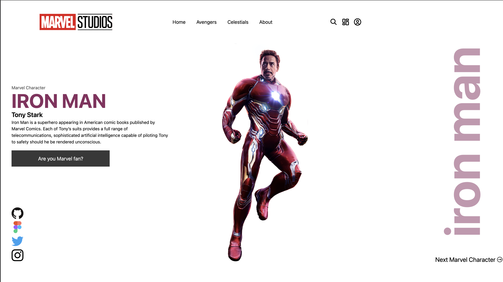
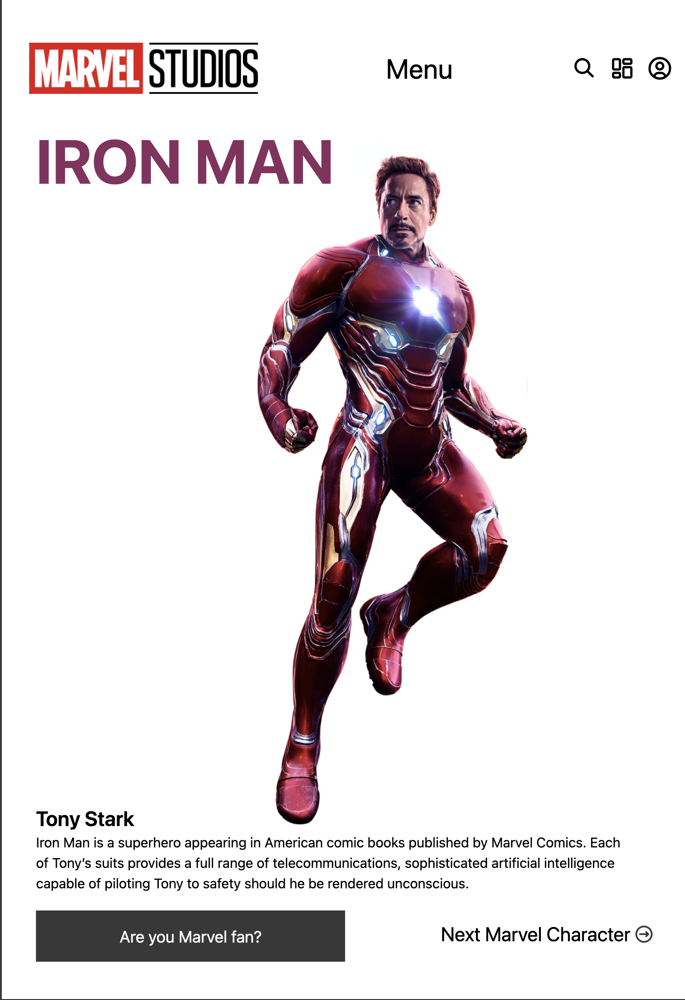
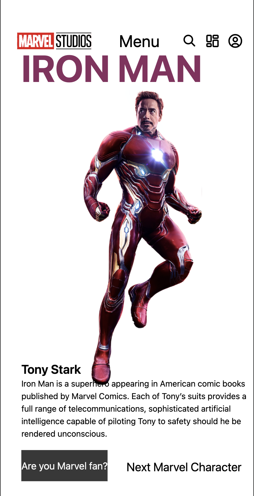

# 🎧 Projeto Final - Homem de Ferro

## Sobre o Projeto

Este projeto se trata de uma landing page prototipada no Figma e com o código feito no Visual Studio Code, se trata do super-herói Iron Man, um herói da Marvel Studios que é conhecido pelo nome Iron man, na landind page contém uma pequena descrição do herói e uma imagem ilustrativa do mesmo.

## Como rodar projeto

Para rodar o projeto, ele pode ser acessado no Github e ao clicar no link azul dentro do repositório, logo estará na própria landing page, o link para acessar o repositório é [este](https://reliable-yttrium-924.notion.site/Atividades-Figma-88af74a199f84cbe9cf27ccdf79daf2b) 

## Tecnologias Utilizadas

- **HTML5** – Estrutura semântica do conteúdo.
- **Tailwind CSS** – Estilização rápida e responsiva com classes utilitárias.
- **Font Awesome** – Ícones visuais como carrinho, coração, usuário, entre outros.
- **Figma** – Criação dos protótipos responsivos.
- **GitHub Pages** – Hospedagem gratuita para o projeto ficar online.

## Screenshots das versões desktop, tablet e mobile

### Versão Tablet

### Versão Mobile
